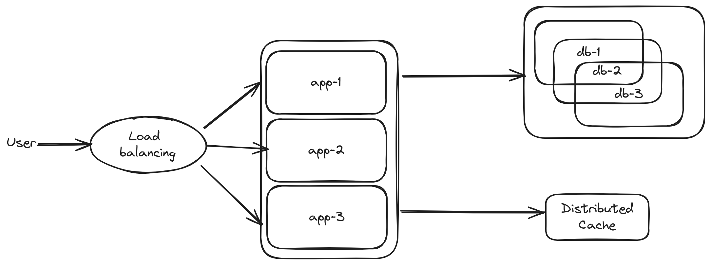
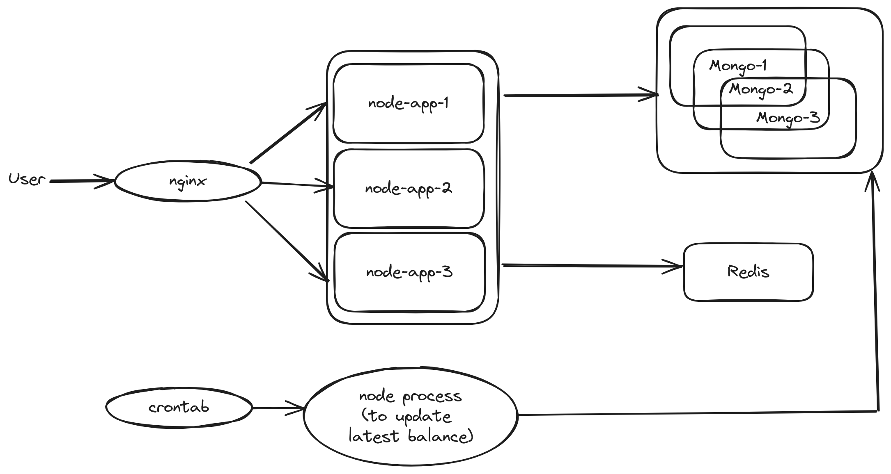

# Clarify Requirements
### Functional Requirements
- Create a new user. There are two user types
  - Monthly worker
  - Daily worker
- Get the user information
- Get the user balance history
- Calculate the balance of all users at once every midnight
### Non-functional Requirements
- Support high concurrency
- Moderate latency
# Back-of-the-envelope Estimation
- 1,000,000 users in total
- 1,000 DAU
# API Design
- POST /api/user
  - request body
    - type
    - salary
  - response body
    - id
    - type
    - salary
    - balance
- GET /api/user/:id
  - request param
    - id
  - response body
    - id
    - type
    - salary
    - balance
- GET /api/balance/:userId/history
  - request param
    - userId
  - response body
    - id
    - userId
    - amount
    - paidDay
- CRON Calculate the balance of all users at once every midnight
  - parameter
    - date
      - default: current date
      - format: YYYY-MM-DD
# Data Model
- Collection user
  - Schema
    - _id: Object ID - user id (PK)
    - type: number - user type
      - 0: Monthly worker
      - 1: Daily worker
    - salary: number - base salary
    - balance: number - user balance
    - v: number - record version
    - createdAt: Date - created date
- Collection balance history
  - Schema
    - _id: Object ID - transaction id (PK)
    - userId: Object ID - user id (FK to user._id)
    - amount: number - added amount
    - paidDay: Date - paid day
  - Indexes
    - userId: DESC, paidDay: DESC - compound index

# High-level Design

# Detailed Design

